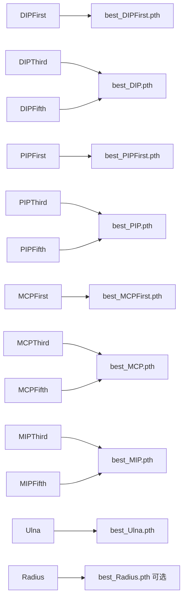
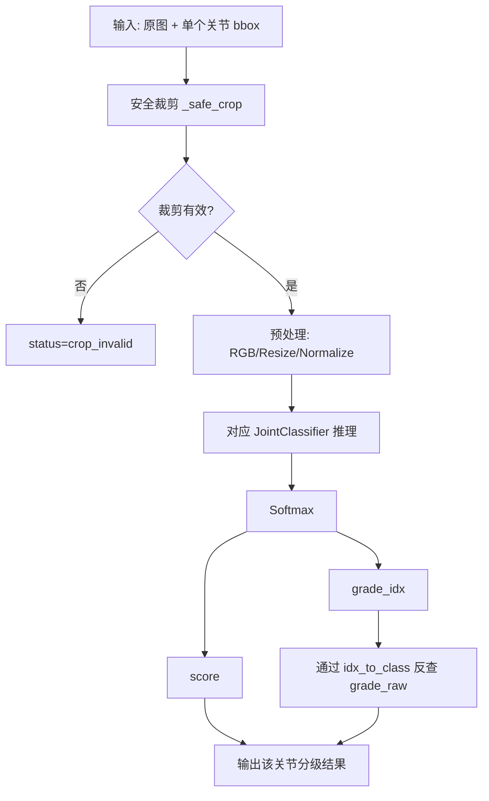

# 关节分级流程图（审查版）

## 1. 总体流程

```mermaid
flowchart TD
    A[上传手部X光图像 + 性别] --> B[/predict 接口]
    B --> C[小关节检测模型 YOLO best.pt]
    C --> D[输出 13 个关节框 + 手性]
    D --> E{是否检测到关节框?}
    E -- 否 --> F[返回空分级结果]
    E -- 是 --> G[逐关节循环]

    G --> H[按 bbox 裁剪 ROI]
    H --> I[Resize 224x224 + ImageNet Normalize]
    I --> J{映射到对应分级模型?}
    J -- 否 --> K[status=model_missing]
    J -- 是 --> L[ResNet50 分级模型推理]
    L --> M[输出 grade_idx/grade_raw/score]
    K --> N[汇总 joint_grades]
    M --> N

    N --> O[缺失分级语义补全 semantic_align_missing_joint_grades]
    O --> P[语义对齐 align_joint_semantics]
    P --> Q[RUS 13点打分 calc_rus_score]
    Q --> R[返回 JSON: joint_detect_13 + joint_grades + RUS结果]
```

## 2. 关节名与模型映射



## 3. 单关节分级子流程



## 4. 接口返回关键字段（审查重点）

- `joint_detect_13`
  - `hand_side`
  - `detected_count`
  - `joints`（每点 bbox 与归一化坐标）
  - `plot_image_base64`
- `joint_grades`
  - key: `DIPFirst/MCPThird/...`
  - value:
    - `model_joint`
    - `grade_idx`
    - `grade_raw`
    - `score`
    - `status` (`ok | model_missing | crop_invalid | semantic_imputed | semantic_default`)
    - `imputed`
    - `source_joint`
- `joint_semantic_13`
- `joint_rus_total_score`
- `joint_rus_details`

## 5. 当前已知审查注意点

1. `best_Radius.pth` 当前目录可能缺失，`Radius` 会先 `model_missing`，随后在语义补全阶段优先参考 `Ulna`。  
2. 小关节检测质量会直接影响裁剪分级结果。  
3. 分级输入预处理已按训练脚本保持：`ImageNet mean/std + 224x224`。  
