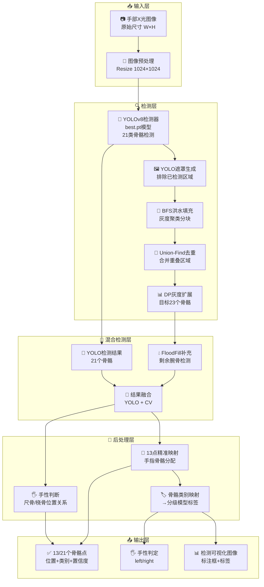
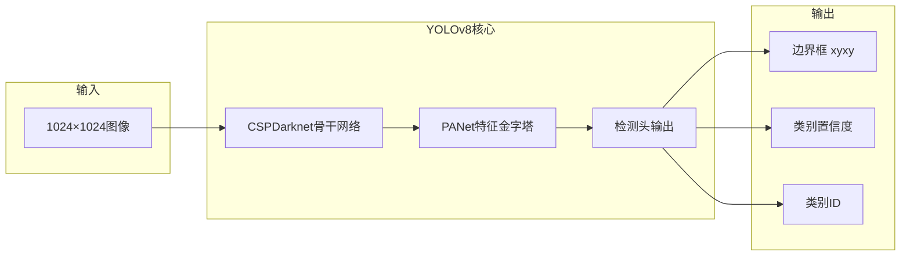
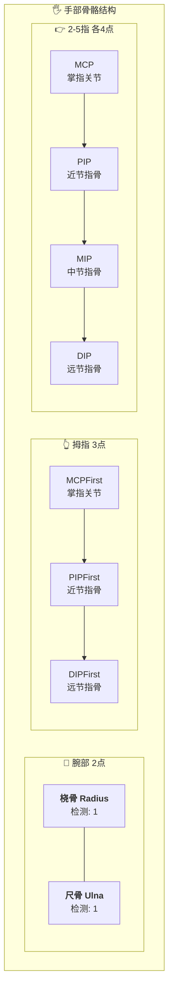
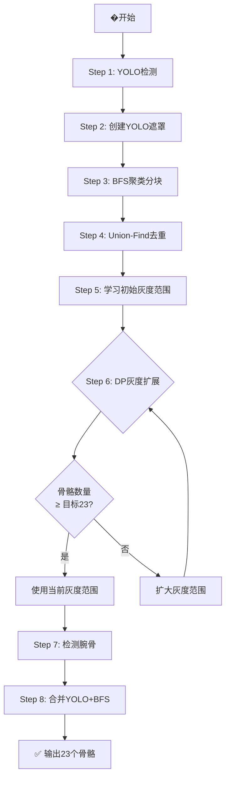
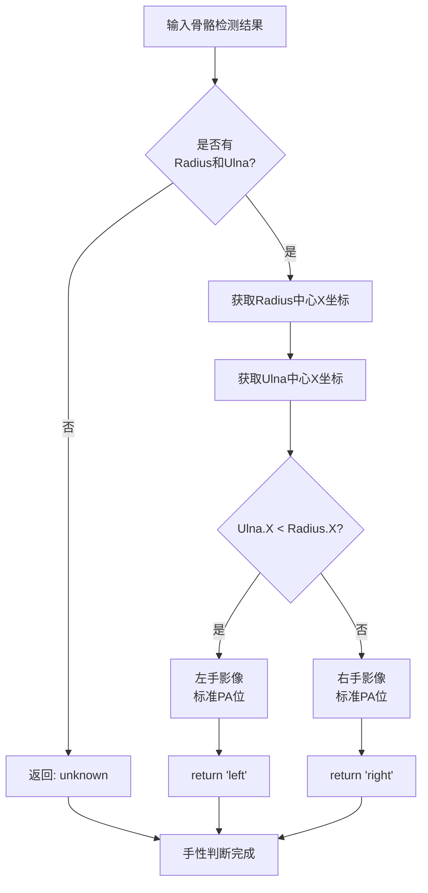
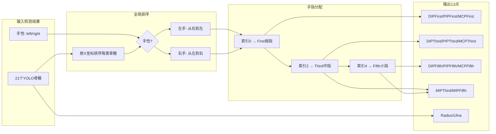
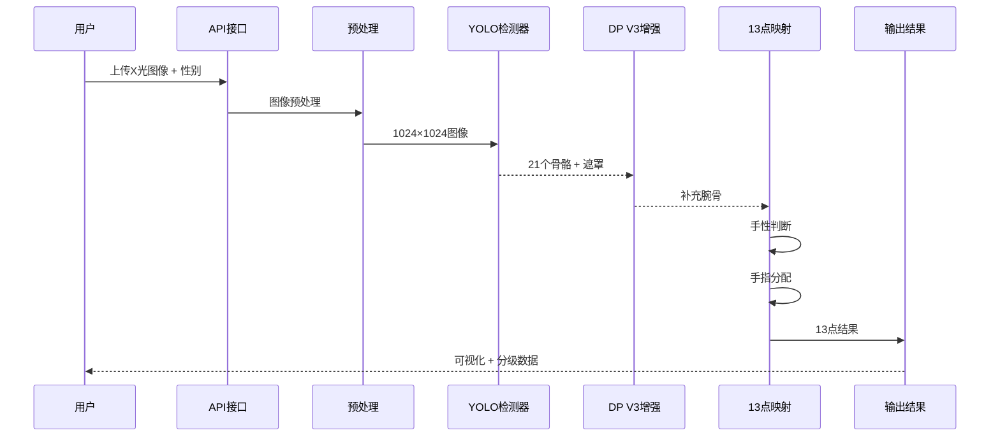

# 小关节识别系统架构图

## 整体架构

## YOLO检测模块详解

## 骨骼类别与检测目标

## DP V3灰度扩展算法流程

## 手性判断逻辑

## 13点手指分配算法

## 完整处理流程

## 性能指标

| 指标 | 数值 |
|------|------|
| mAP50 | 0.994 |
| mAP50-95 | 0.734 |
| 检测类别数 | 7类 |
| 目标骨骼数 | 13/21/23 |
| 单图处理时间 | ~10ms |
